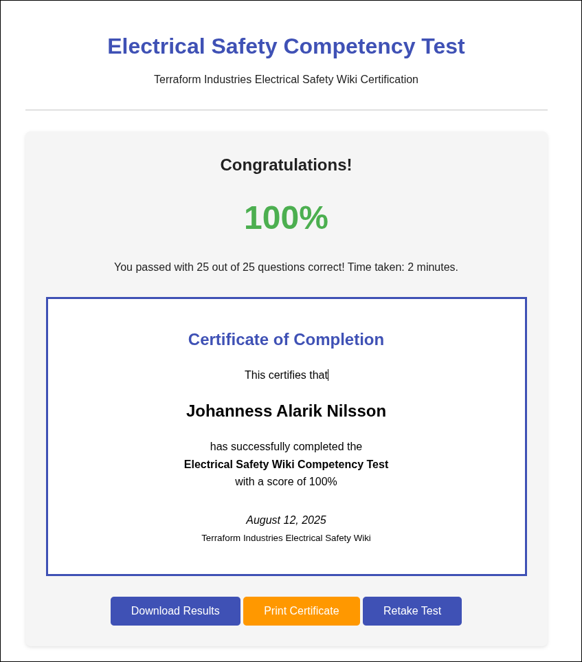

# Electrical Safety Certification

To complete your electrical safety certification:

## Step 1: Review This Document

Read through this entire training document and ensure you understand all
safety procedures and requirements.

## Step 2: Complete the Online Competency Test

Access the competency test at:
[/competency-test/](https://terraform-industry.github.io/electrical-safety-wiki/competency-test/)

<!-- markdownlint-disable -->
<figure style="text-align: center;">
  
  <figcaption><em>UPON COMPLETION: Your Electrical Safety Certificate should be added to your personnel safety compliance record.</em></figcaption>
</figure>
<!-- markdownlint-enable -->

## Step 3: Complete Hands-On Training

Once you have passed achieved a passing grade and been awarded your certificate
you are ready to move on to the **Hands-On Electrical Training**

Hands-On Training sessions are scheduled periodically & will include:

- Proper PPE usage
- DVOM / Multi-meter / HiPot operation
- Wiring Crash-Course
- Emergency response procedure drills

---

**Remember:** Electrical safety is everyone's responsibility. When in doubt,
ask for help and always err on the side of caution.
