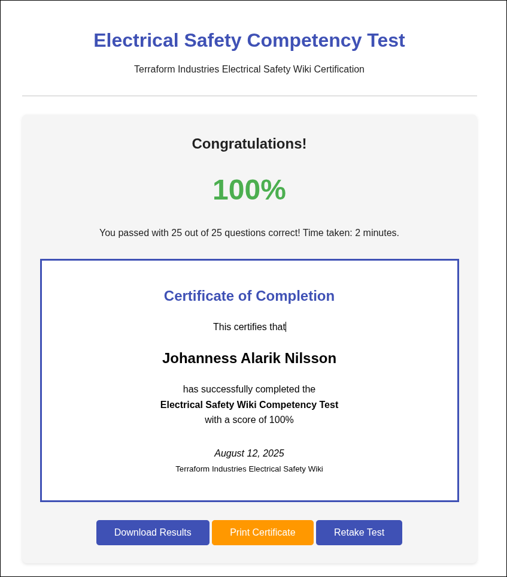

# Electrical Safety Certification

To complete your electrical safety certification:

## Step 1: Review This Document

Read through this entire training document and ensure you understand all
safety procedures and requirements.

## Step 2: Complete the Online Competency Test

Access the quiz at: <https://forms.gle/eqx4mEoCHaqHyLJU6>

## Step 3: Complete Hands-On Training

Hands-On Training sessions are scheduled monthly & will include:

- Proper PPE usage
- DVOM / Multi-meter operation
- Emergency response procedures

---

**Remember:** Electrical safety is everyone's responsibility. When in doubt,
ask for help and always err on the side of caution.
