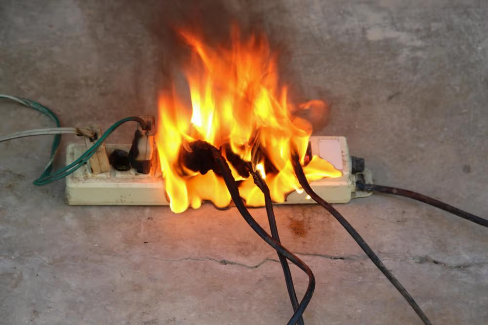
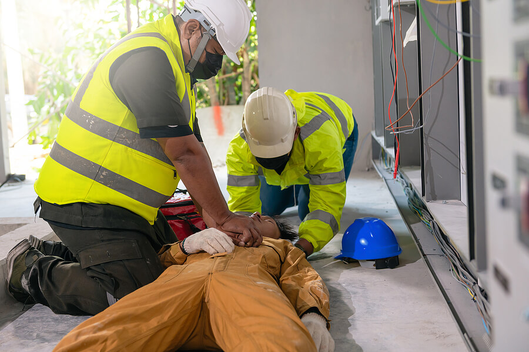

# Electrical Safety Training - Overview

Electrical safety is simple, yet critical. The purpose of electrical safety
training is to keep you and all of your coworkers safe from burns, electric
shock, and death.

## Core Principles

This training covers three fundamental principles:

- **Identifying risks** - Understanding electrical hazards in the workplace
- **Mitigating hazards** - Implementing safety measures and best practices
- **Incident response** - Knowing what to do in the event of an electrical
  safety incident

## Key Safety Threshold

- AC and DC voltages above 60V are considered hazardous

## Primary Electrical Hazards

- Electrical Fire
- Arc Flash/Arc Blast
- Electrical Shock

