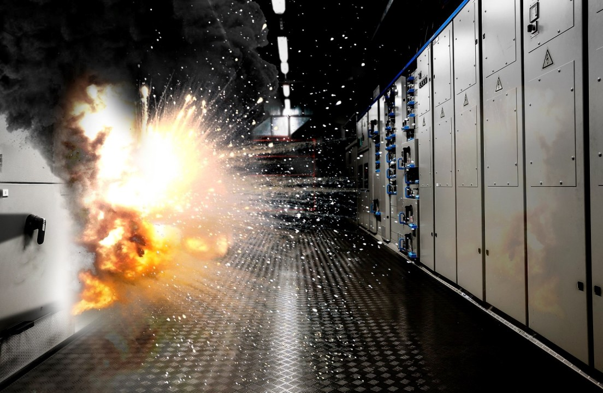
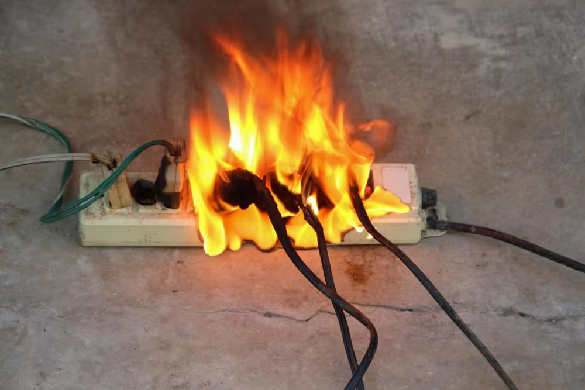
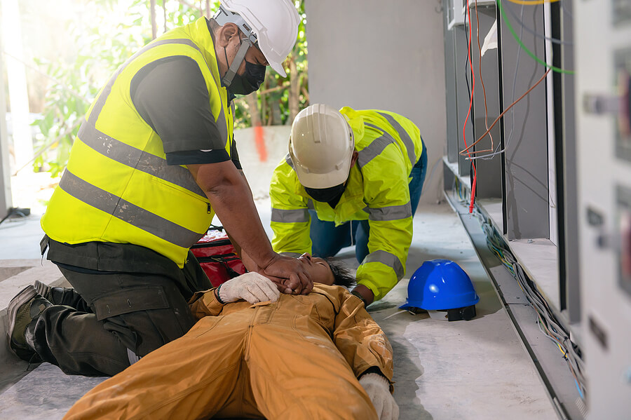

# Terraform Industries Electrical Safety Wiki

## Overview

Electrical safety is simple, yet critical. The purpose of electrical safety
training is to keep you and all of your coworkers safe from burns, electric
shock, and death.

### Core Principles

This training covers three fundamental principles:

- **Identifying risks** - Understanding electrical hazards in the workplace
- **Mitigating hazards** - Implementing safety measures and best practices
- **Incident response** - Knowing what to do in the event of an electrical
  safety incident

### Key Safety Threshold

- AC and DC voltages above 60V are considered hazardous

### Primary Electrical Hazards

- Electrical Fire
- Arc Flash/Arc Blast
- Electrical Shock

## Training Topics

This training covers:

### Electrical Hazard Identification

- General Hazards
- AC Systems
- Photovoltaic DC Systems
- Battery DC Systems

### Hazard Mitigation and Response

- Best Practices for Working Around Electrical Hazards
- Selecting the Right PPE
- Emergency Response Procedures

## Navigation Guide

This electrical safety training is organized into the following sections:

### Fundamentals

- [Overview](fundamentals/overview.md) - Core principles and safety thresholds
- [Training Topics](fundamentals/training-topics.md) - What this training covers

### Procedures

- [Hazard Identification](procedures/hazard-identification.md) - Recognizing
  electrical hazards
- [Common Hazard Sources](procedures/common-hazard-sources.md) - Where hazards
  occur
- [Safety Best Practices](procedures/safety-best-practices.md) - How to work
  safely

### Emergency

- [Emergency Response](emergency/emergency-response.md) - What to do in an
  emergency
- [Safety Certification](emergency/safety-certification.md) - How to get
  certified

## Author Attribution

This training material was developed by Johanness A. Nilsson
<johanness.nilsson@terraformindustries.com> for Terraform Industries
electrical safety training program.

---

**Remember:** Electrical safety is everyone's responsibility. When in doubt,
ask for help and always err on the side of caution.