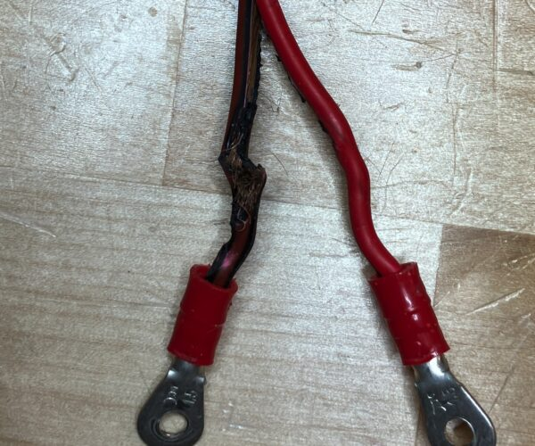
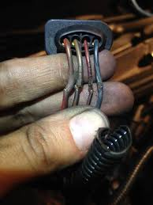
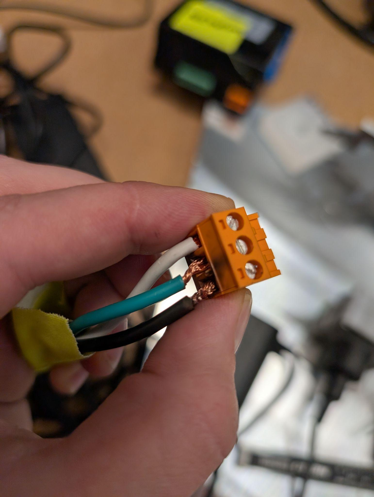
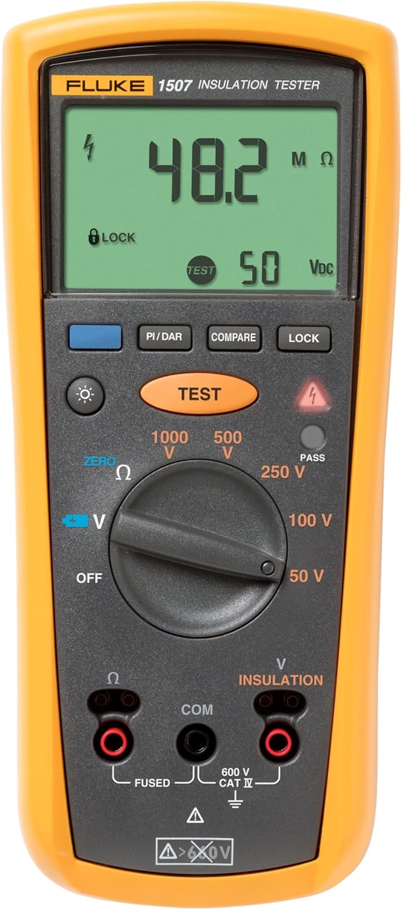
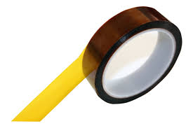
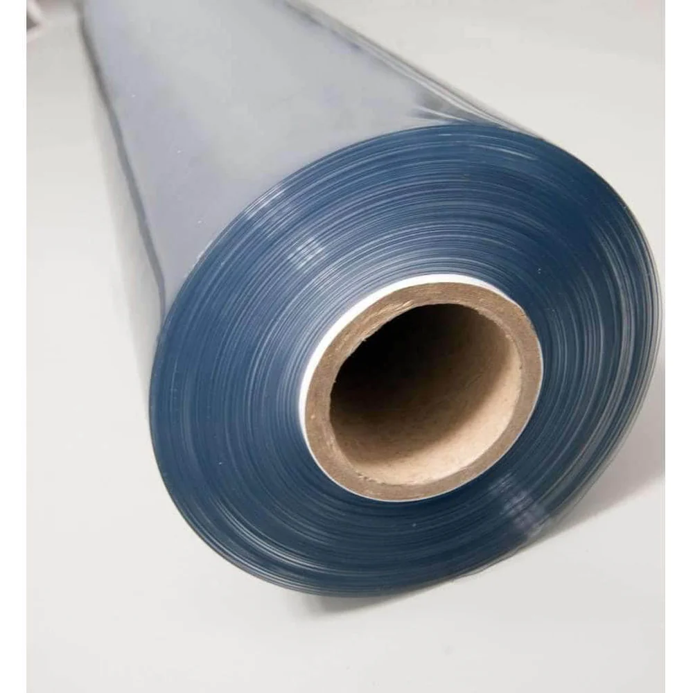
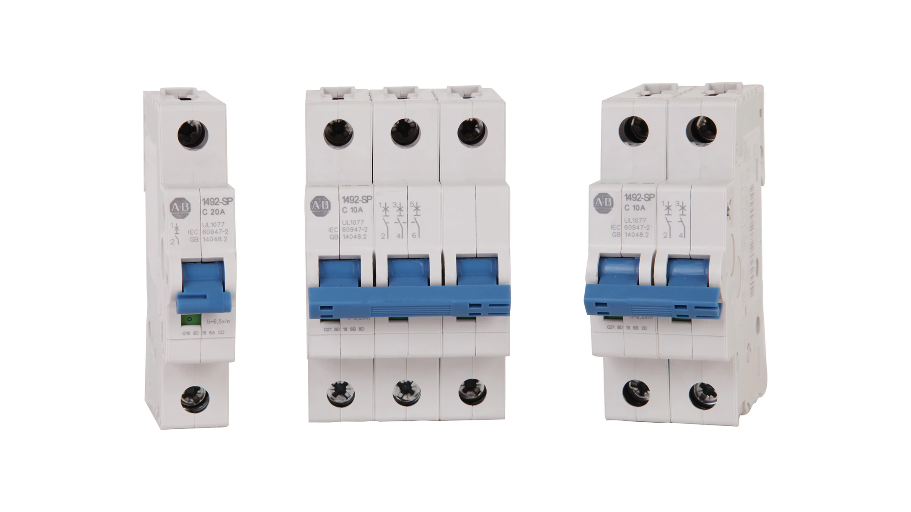

# Common Hazard Sources

## Wiring Issues

**Risk Factors:**

- Damaged or frayed wires increase risk of arc, shock, and short circuit
- Exposed conductors visible outside of connectors create increased risk of arc
  and short circuit
- Messy wire strands increase the risk of short circuit

<!-- markdownlint-disable -->
<figure style="text-align: center;">
  
  <figcaption><em>Damaged DC conductor with melted PVC coating - This creates immediate fire risk and potential for arc flash</em></figcaption>
</figure>
<!-- markdownlint-enable -->

<!-- markdownlint-disable -->
<figure style="text-align: center;">
  
  <figcaption><em>Heat damage causing brittle insulation - Hardened sheathing cracks and exposes conductors, creating shock and arc hazards</em></figcaption>
</figure>
<!-- markdownlint-enable -->

<!-- markdownlint-disable -->
<figure style="text-align: center;">
  
  <figcaption><em>Frayed wire strands - Messy strands increase risk of short circuits and arcing between conductors</em></figcaption>
</figure>
<!-- markdownlint-enable -->

<!-- markdownlint-disable -->
<figure style="text-align: center;">
  
  <figcaption><em>Improper termination - Missing ferrules and oversized AWG wire for connector rating creates fire and arc flash risks</em></figcaption>
</figure>
<!-- markdownlint-enable -->

## High Voltage Enclosure Commissioning and Service

**Key Risks:**

- Powering on a panel for the first time is one of the most likely times for
  short circuit events

**Best Practices:**

- Measure line-to-line and line-to-ground resistance with a mega ohm meter or
  `HI pot` before commissioning to verify there is no short circuit
- Always unplug power and de-energize the system before inspecting it
- If you believe de-energizing is not feasible, clear your plan with Jon or
  Johannes before proceeding

<!-- markdownlint-disable -->
<figure style="text-align: center;">
  
  <figcaption><em>High voltage enclosure commissioning - Always measure insulation resistance before first power-on to prevent short circuit events</em></figcaption>
</figure>
<!-- markdownlint-enable -->

## Test Setups

The highest risk scenarios are test setups that work with high voltage AC or DC
power. In our efforts to move quickly, we cannot forget to take steps to be
safe.

**Safety Requirements:**

- Use over current protection: circuit breaker, fuse, or power supply with
  limited current capability
- Insulate live voltages using appropriate materials:
  - Vinyl sheet and Kapton tape for low temperature systems
  - Fiberglass-based insulation for high temperature applications

<!-- markdownlint-disable -->
<figure style="text-align: center;">
  
  <figcaption><em>Kapton Tape</em></figcaption>
</figure>
<!-- markdownlint-enable -->

<!-- markdownlint-disable -->
<figure style="text-align: center;">
  
  <figcaption><em>High voltage Vinyl Arc Barrier - Provides enclosures with overcurrent arc protection, essential for test setups above 60V</em></figcaption>
</figure>
<!-- markdownlint-enable -->

<!-- markdownlint-disable -->
<figure style="text-align: center;">
  
  <figcaption><em>DIN rail mount Safety Breakers</em></figcaption>
</figure>
<!-- markdownlint-enable -->
