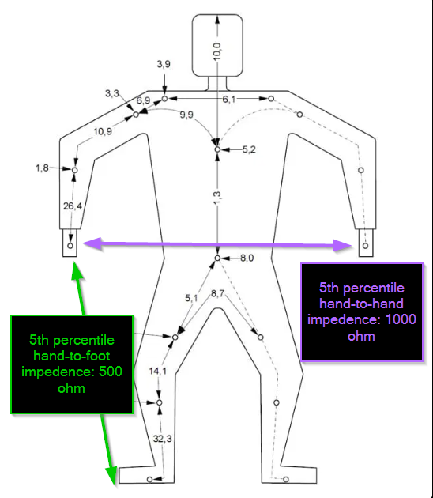

# Electrical Hazard Identification

## Arc Flash

**Cause:** Arc Flash/Arc Blast is caused by a rapid surge of power through the
system due to a short circuit. The voltage breaks down air into a conductor,
creating an explosive release of energy.

**Example:** The electrolyzer team experienced a very minor arc flash while
load cell testing in November 2024.

<!-- markdownlint-disable -->
<figure style="text-align: center;">
  
  <figcaption><em>Arc-flash damage to terminal block from November 2024 incident - Notice the severe burning and melting caused by the electrical arc. This occurred because ferrules were not used and the wire gauge was larger than the Phoenix terminal connector was rated for.</em></figcaption>
</figure>
<!-- markdownlint-enable -->

**Effects:** Arc flash can lead to:

- Fire and vaporization of conductors and enclosures
- Intense light bright enough to cause burned retinas
- Molten metal expulsion that can cause lung damage, burns, death, and
  dismemberment

**Incident Energy Calculations:**

- Arc Energy: 5.8 cal/cm²
  <!-- markdownlint-disable -->
  <video controls width="100%" style="max-width: 800px;">
    <source src="../../media/bussmann-series-arc-flash-test-4-5.8-calscm2.mp4" type="video/mp4">
    Your browser does not support the video tag.
  </video>
  <!-- markdownlint-enable -->

- Incident Energy: 1.6 cal/cm²
  <!-- markdownlint-disable -->
  <video controls width="100%" style="max-width: 800px;">
    <source src="../../media/bussmann-series-arc-flash-test-3-1.6-calscm2.mp4" type="video/mp4">
    Your browser does not support the video tag.
  </video>
  <!-- markdownlint-enable -->

The critical factor to consider is the incident energy—this is the energy from
the blast that directly impacts you. Arc energy originates from a single point,
and the farther you are from this point, the less incident energy your body
will be exposed to.

Terraform's AC grid, photovoltaic arrays, and battery systems all have
different incident energies. Based on calculations, Class 1 PPE is sufficient
for our systems. More details are provided in the hazard mitigation section.

<!-- markdownlint-disable -->
<figure style="text-align: center;">
  <figcaption><em>The red lines illustrate the incident energy or shock wave radiating outward from the arc flash, while the center explosion represents the arc energy source point</em></figcaption>
  
</figure>
<!-- markdownlint-enable -->

## Electrical Arcing

**Cause:** When live voltages get too close, they can break down the air
between them, creating an arc. Proper clearances must be maintained.

**Effects:** Sustained arcs can reach temperatures up to 3000°C, leading to:

- Vaporization of metals and plastics
- Risk of system fires
- Severe burns to personnel

<!-- markdownlint-disable -->
<figure style="text-align: center;">
  
  <figcaption><em>Electrical arcing damage - Note the carbonization and burn patterns from sustained arcing between conductors</em></figcaption>
</figure>
<!-- markdownlint-enable -->

**Standards:** Clearance requirements are dictated by [UL 62368-1](<https://en.wikipedia.org/wiki/UL_(safety_organization)#Standards>). Working
voltage is multiplied by 2 to account for surge conditions. This establishes
the minimum allowable distance for line-to-line and line-to-ground spacing in
ungrounded systems.

<!-- markdownlint-disable -->
<figure style="text-align: center;">
  
  <figcaption><em>UL 62368-1 Clearance Requirements - Minimum spacing distances based on working voltage × 2 for surge conditions</em></figcaption>
</figure>
<!-- markdownlint-enable -->

<!-- markdownlint-disable -->
<figure style="text-align: center;">
  
  <figcaption><em>WARNING: Electrical arc burn injury - This illustrates the severe burns that can result from electrical arcing incidents</em></figcaption>
</figure>
<!-- markdownlint-enable -->

## Electrical Shock

**Cause:** The human body acts as a resistor. It does not take very much
current to cause real damage. Low frequency AC (such as 60Hz) is more dangerous
than DC due to its tendency to prevent the person in shock from letting go.

**Current Thresholds:**

- AC current of concern: >15mA
- DC current of concern: >100mA

**Example:** Someone touches one phase of a 3-phase 480V circuit due to a nick
in the cable while their feet are on concrete. Current surges through their
body toward the ground, passing through their heart.

**Effects:**

- Exposure to prolonged current can cause damage to deep tissues, even if the
  skin looks fine
- Electrical shock can cause fibrillation and cardiac arrest
- **Always seek medical attention immediately after any electrical shock**

**Important Fact:** Most of the body's resistance is in the skin. Your
resistance is drastically lower if your skin is wet or has any type of cut or
scrape.

_*Based on IEC 60479-1*_

## Electrical Fire

**Cause:** Electrical systems can get dangerously hot without needing to arc:

- Moderate to high currents can make undersized conductors hot enough to burn
  you or catch fire
- High current systems see increased fire risk with poor busbar-to-busbar
  torques or corrosion on contact faces

**Effects:**

- Burns to personnel
- Risk of igniting other flammable materials in the area

**Common Causes:**

- Poor electrical connections
- Undersized wires for the current load

<!-- markdownlint-disable -->
<figure style="text-align: center;">
  
  <figcaption><em>This exemplifies what happens when more current is drawn through a conductor than it is rated for. Normally, a breaker would trip the circuit open before there was any smoke or fire risk.</em></figcaption>
</figure>
<!-- markdownlint-enable -->
