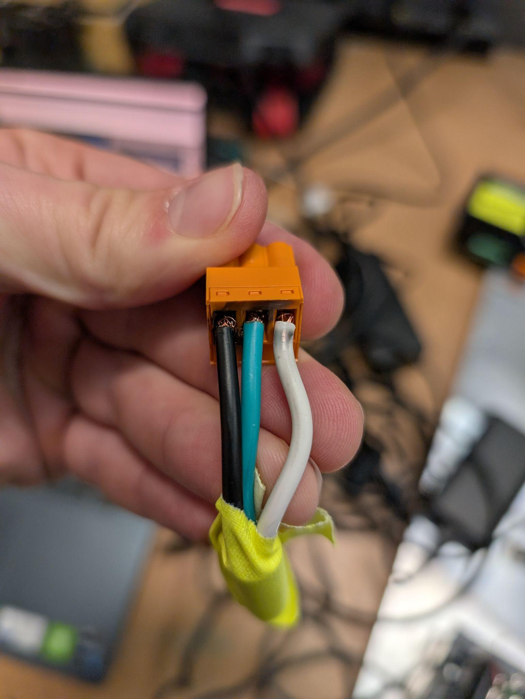
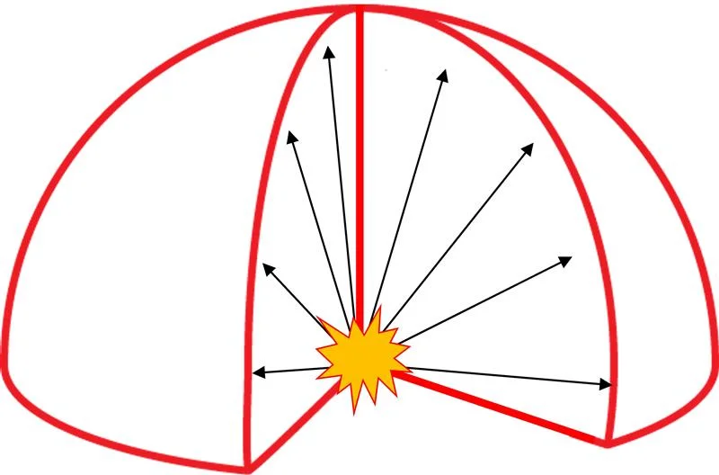
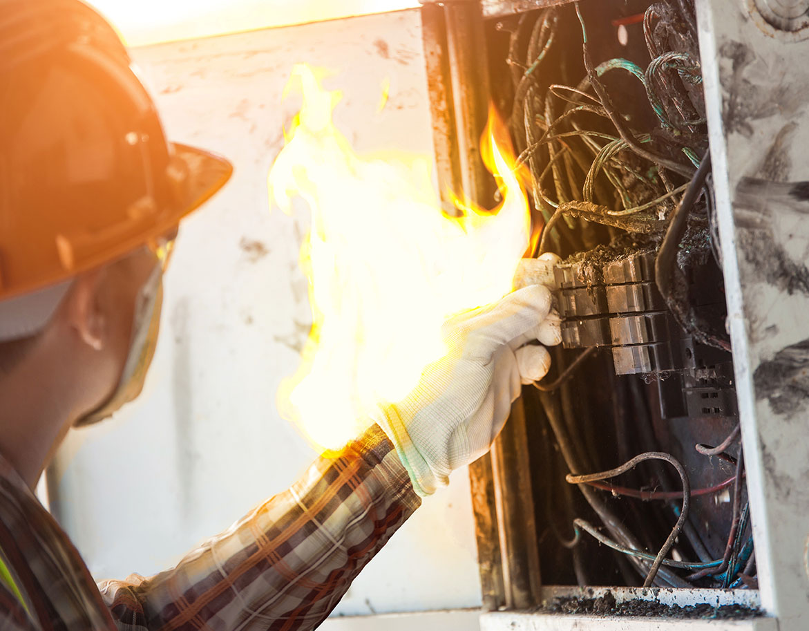
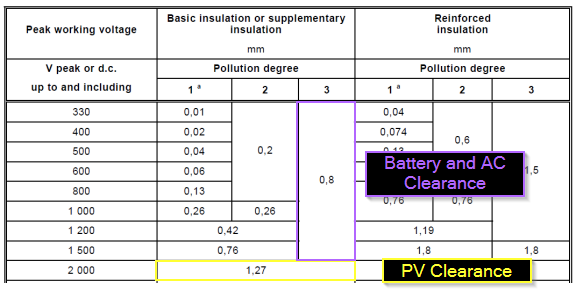
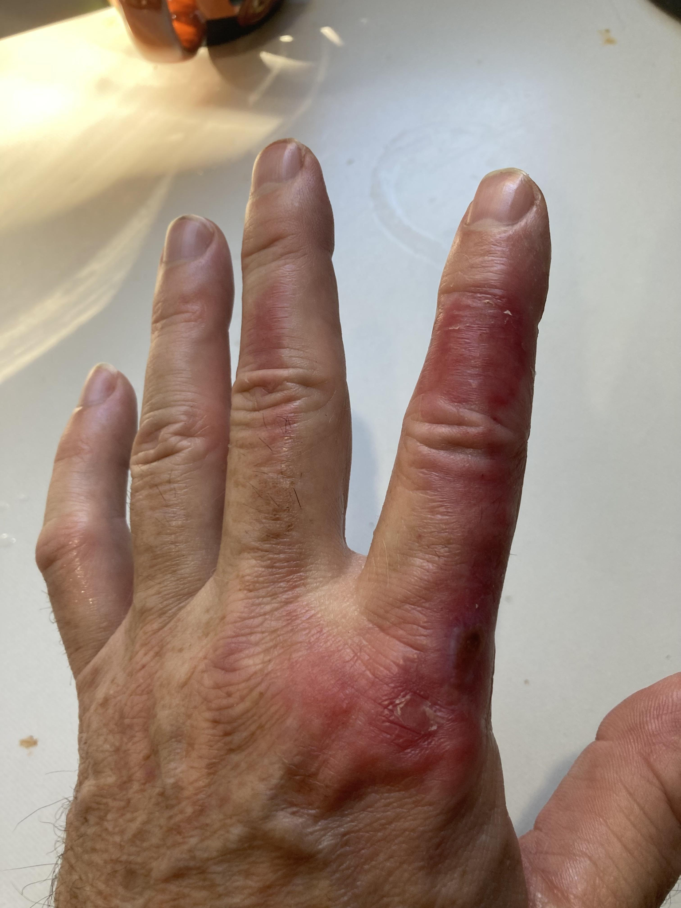
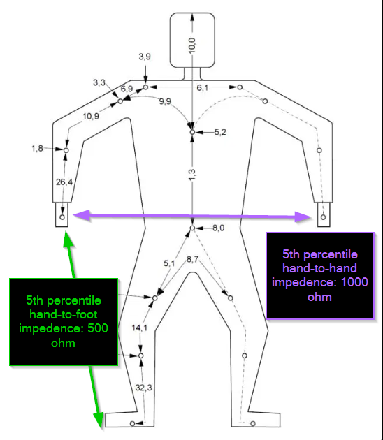
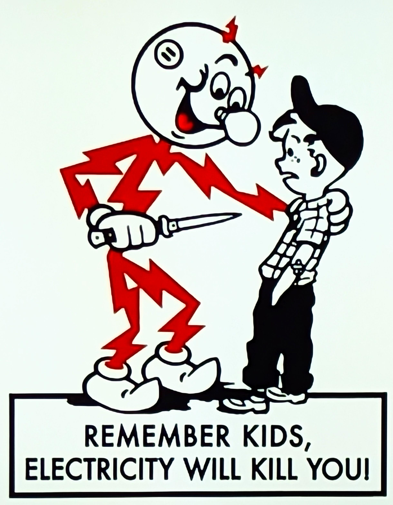
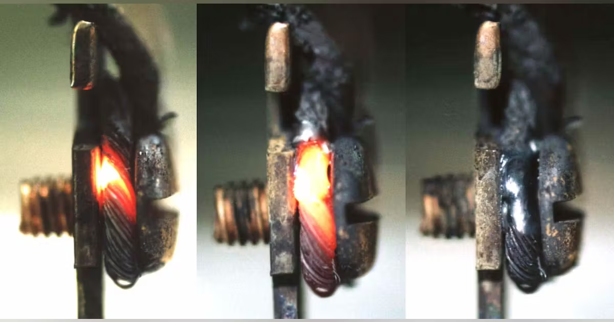

# Electrical Hazard Identification

## Arc Flash

**Cause:** Arc Flash/Arc Blast is caused by a rapid surge of power through the
system due to a short circuit. The voltage breaks down air into a conductor,
creating an explosive release of energy.

**Example:** The electrolyzer team experienced a very minor arc flash while
load cell testing in November 2024.

<!-- markdownlint-disable -->
<figure style="text-align: center;">
  
  <figcaption><em>Arc-flash damage to terminal block from November 2024 incident - Notice the severe burning and melting caused by the electrical arc. This occurred because ferrules were not used and the wire gauge was larger than the Phoenix terminal connector was rated for.</em></figcaption>
</figure>
<!-- markdownlint-enable -->

**Effects:** Arc flash can lead to:

- Fire and vaporization of conductors and enclosures
- Intense light bright enough to cause burned retinas
- Molten metal expulsion that can cause lung damage, burns, death, and
  dismemberment

### Arc Flash Demonstration Videos

**⚠ WARNING:** The following videos demonstrate the frightening and lethal
destructive power of arcing in high-energy electrical systems. These are
controlled laboratory demonstrations showing real arc flash events at
different energy levels under carefully monitored conditions.

**The following videos demonstrate arc flash events at two different incident
energy levels:**

- Arc Energy: 5.8 cal/cm²
  <!-- markdownlint-disable -->
  <video controls width="100%" style="max-width: 800px;">
    <source src="../../media/bussmann-series-arc-flash-test-4-5.8-calscm2.mp4" type="video/mp4">
    Your browser does not support the video tag.
  </video>
  <!-- markdownlint-enable -->

- Incident Energy: 1.6 cal/cm²
  <!-- markdownlint-disable -->
  <video controls width="100%" style="max-width: 800px;">
    <source src="../../media/bussmann-series-arc-flash-test-3-1.6-calscm2.mp4" type="video/mp4">
    Your browser does not support the video tag.
  </video>
  <!-- markdownlint-enable -->

**The following high-speed footage was captured at 1000 frames per second**
The video reveals the immense destructive power of arc flash events in slow
motion. This lab demonstration illustrates catastrophic failures that occur
faster than any human can react. When an arc flash strikes—a worker has no
chance of getting out of the way!

<!-- markdownlint-disable -->
<video controls width="100%" style="max-width: 800px;">
  <source src="../../media/arc-flash-real-world-demonstration.mp4" type="video/mp4">
  Your browser does not support the video tag.
</video>
<!-- markdownlint-enable -->

Arc flash events can reach temperatures of **20,000°C** —that is nearly
four times hotter than the surface of the Sun! These extreme temperatures
cause disabling second and third degree burns within milliseconds of exposure.
The event creates an arc blast pressure wave reaching thousands of pounds per
square inch, powerful enough to knock workers off ladders, rupture eardrums,
or collapse lungs. The blast blows equipment apart and propels molten metal
shrapnel with enough force to completely penetrate through a worker's body.

When viewing these demonstrations, observe the explosive force, blinding
light, molten metal spray, and instantaneous destruction of equipment. An
unprotected worker could be severely injured or killed by any of these
effects. This is why proper PPE and preventative safety procedures are
absolutely **NON NEGOTIABLE**! Following strict safety protocols is critical
when we work with high energy electrical systems.

**REMEMBER:**  
Any attempts to disable or circumvent any electrical safety devices or
_LOTO_ equipment will be grounds for your immediate dis-honorable termination
and dismissal.

The critical factor to consider is the incident energy—this is the energy from
the blast that directly impacts you. Arc energy originates from a single point,
and the farther you are from this point, the less incident energy your body
will be exposed to.

Terraform's AC grid, photovoltaic arrays, and battery systems all have
different incident energies. Based on calculations, Class 1 PPE is sufficient
for our systems. More details are provided in the hazard mitigation section.

<!-- markdownlint-disable -->
<figure style="text-align: center;">
  <figcaption><em>The red lines illustrate the incident energy or shock wave radiating outward from the arc flash, while the center explosion represents the arc energy source point</em></figcaption>
  
</figure>
<!-- markdownlint-enable -->

## Electrical Arcing

**Cause:** When live voltages get too close, they can break down the air
between them, creating an arc. Proper clearances must be maintained.

**Effects:** Sustained electrical arcs—such as those from high-current
industrial faults or welding—can easily reach 3000 °C, which is already hot
enough to melt steel and vaporize many metals. However, depending on the
current density, arc length, and surrounding environment, plasma core
temperatures can exceed 6000 °C and in extreme cases approach 20 000 °C,
leading to:

- Vaporization of metals and plastics
- High risk of system fires
- Severe burns to personnel
- DEATH

<!-- markdownlint-disable -->
<figure style="text-align: center;">
  
  <figcaption><em>What NOT to do in an electrical arc fire - Note: Always use a CLASS C fire extinguisher. NEVER attempt to manually shut off a breaker that has sustaining arcing between conductors! Go to the panel source!</em></figcaption>
</figure>

**Standards:** Clearance requirements are dictated by [UL 62368-1](<https://en.wikipedia.org/wiki/UL_(safety_organization)#Standards>).  
Working voltage is multiplied by 2 to account for surge conditions.
This establishes the minimum allowable distance for line-to-line and
line-to-ground spacing in ungrounded systems.

<figure style="text-align: center;">
  
  <figcaption><em>UL 62368-1 Clearance Requirements - Minimum spacing distances based on working voltage × 2 for surge conditions</em></figcaption>
</figure>

<figure style="text-align: center;">
  
  <figcaption><em>⚠ WARNING: Electrical arc burn injury - This illustrates the severe burns that can result from electrical arcing incidents</em></figcaption>
</figure>
<!-- markdownlint-enable -->

## Electrical Shock

**Cause:** The human body acts as a resistor. It does not take very much
current to cause real damage. Low frequency AC (such as 60Hz) is more dangerous
than DC due to its tendency to prevent the person in shock from letting go.

**Current Thresholds:**

- AC current of concern: >15mA
- DC current of concern: >100mA

**Example:** Someone touches one phase of a 3-phase 480V circuit due to a nick
in the cable while their feet are on concrete. Current surges through their
body toward the ground, passing through their heart.

**Effects:**

- Exposure to prolonged current can cause damage to deep tissues, even if the
  skin looks fine
- Electrical shock can cause fibrillation and cardiac arrest
- **Always seek medical attention immediately after any electrical shock**

**Important Fact:** Most of the body's resistance is in the skin. Your
resistance is drastically lower if your skin is wet or has any type of cut or
scrape.

_*Based on IEC 60479-1*_

<!-- markdownlint-disable -->
<figure>
  

    
  

  <figcaption style="text-align: left;"><em>
    This diagram illustrates the electrical impedance pathways through the human body, critical for understanding electric shock risks and physiological effects. The figure shows resistance values for the 5th percentile of the population—those with the lowest body impedance who face the highest risk from electrical contact.
      
    Typical body impedance ranges from 1000-2000Ω for dry skin contact, but can drop below 500Ω with wet or broken skin. The hand-to-foot path is particularly dangerous as it directs current through the torso and potentially the heart. Even relatively low voltages (50V+) can drive lethal currents of 50-100mA through these low-resistance paths, causing ventricular fibrillation.
      
    The segmented resistance values demonstrate how factors like moisture, skin integrity, contact pressure, and contact area dramatically affect total body impedance. Sweaty hands, cuts, or large contact areas can reduce skin resistance from thousands of ohms to mere hundreds.
      
    These values explain why electrical safety standards set conservative voltage thresholds (typically 50V AC, 120V DC) and why even household voltages (120/240V) must be treated as potentially lethal—under worst-case conditions, the human body presents minimal resistance to current flow through vital organs.
  </em></figcaption>
</figure>

<!-- markdownlint-enable -->

## Electrical Fire

**Cause:** Electrical systems can get dangerously hot without needing to arc:

- Moderate to high currents can make undersized conductors hot enough to burn
  you or catch fire
- High current systems see increased fire risk with poor busbar-to-busbar
  torques or corrosion on contact faces

**Effects:**

- Burns to personnel
- Risk of igniting other flammable materials in the area

**Common Causes:**

- Poor electrical connections
- Undersized wires for the current load

<!-- markdownlint-disable -->
<figure style="text-align: center;">
  
  <figcaption><em>This exemplifies what happens when more current is drawn through a conductor than it is rated for. Normally, a breaker would trip the circuit open before there was any smoke or fire risk.</em></figcaption>
</figure>
<!-- markdownlint-enable -->
