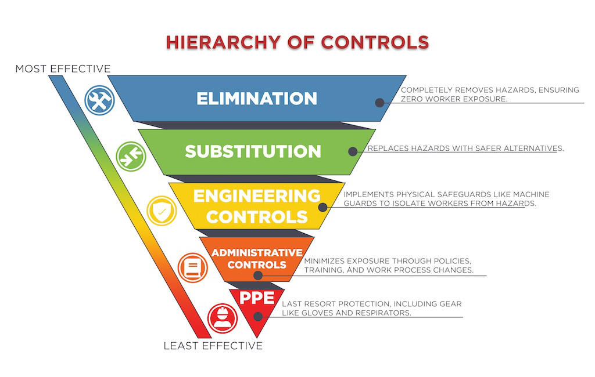
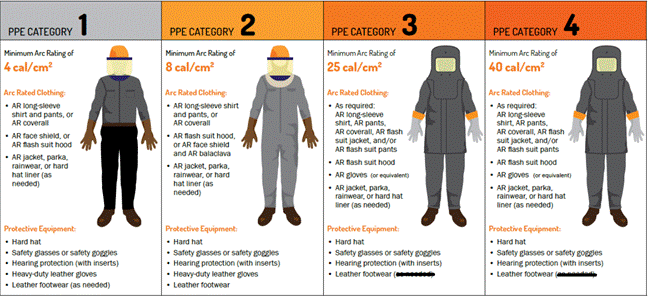
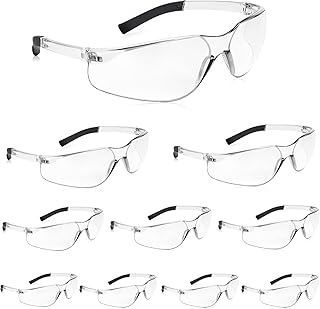
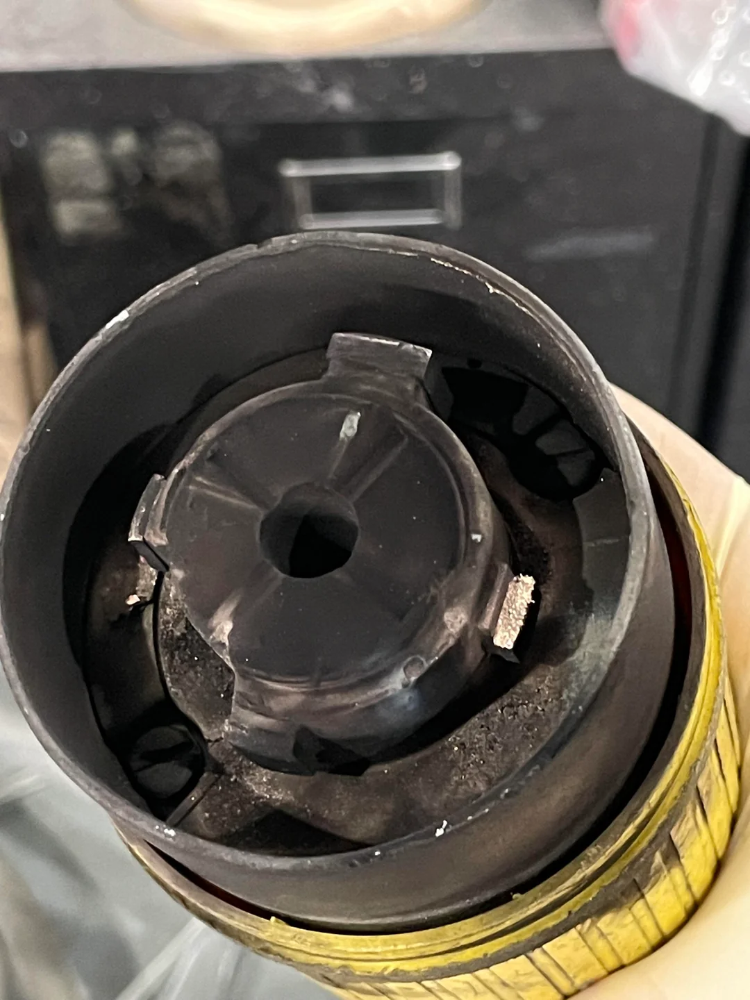
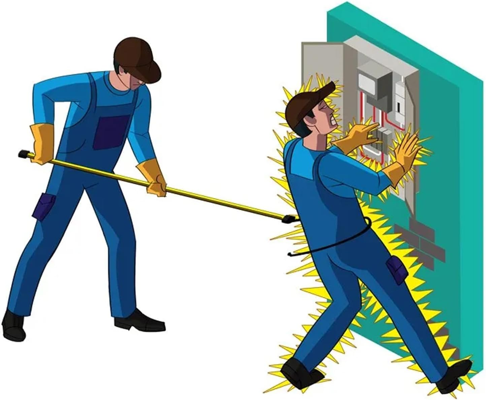
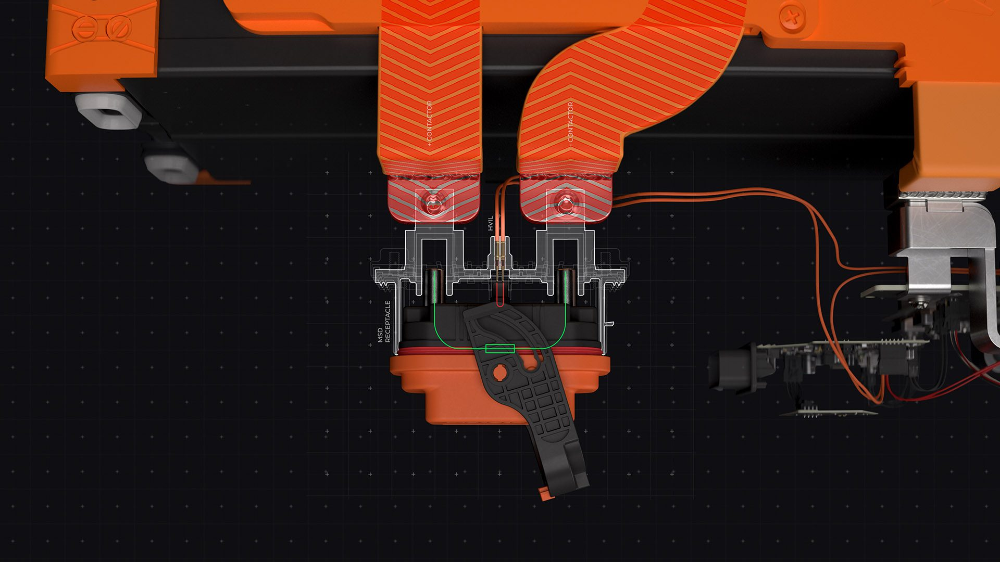

# Safety Best Practices

## Primary: Design the Hazard Away

This is the primary solution for electrical safety.

**Hierarchy of Controls:**

1. **Eliminate:** Delete or replace the hazard altogether
2. **Reduce:** If the hazard must exist, add features to minimize risk:
   - Guards to prevent access to hazards
   - Over current protections to reduce severity
   - Process steps to verify hazards are not present during system assembly

## Wear Appropriate PPE

Working at Terraform Industries exposes you to PPE Category 1 level risks. The
following PPE is **required** when working around 208 VAC, 480 VAC,
photovoltaic VDC, and battery VDC systems:

**Required PPE:**

- Insulated rubber gloves with leather protective covers
- Arc-rated (AR) lab coat or jacket
- Safety glasses

**PPE Locations:**

- Lab Coats: Located near the Black PPE cabinet in DAC Bay
- Insulated Gloves: Located in Black PPE cabinet
- Safety Glasses: Available throughout facility

## Trust But Verify

When working on high voltage systems, always measure the system voltage before
removing your PPE.

**Key Points:**

- Even if unplugged, capacitors can store enough energy to seriously harm you
- Use your PPE and a DVOM (digital voltage ohm meter) rated for the system
  voltage
- Verify the voltage is at or below 60V before considering the system safe
- Always follow proper DVOM usage procedures

## Never Connect or Disconnect Under Load

Connecting or disconnecting connectors under load significantly increases the
risk of arcing. Many components are not designed to safely extinguish arcs or
withstand the intense heat they generate.

**Proper Procedure:**

1. Always disconnect the load first using:
   - Circuit breaker
   - Service disconnect
   - Contactor
   - Solid-state relay
2. Then safely unplug the connector
3. For 480V and 208V tools:
   - Turn off the breaker before plugging in the component
   - Secure the connection
   - Turn the breaker back on

**Warning:** The example connector shown vaporized due to an arc while being
plugged in under load.

**Reference:** [Reddit example of 480V receptacle explosion](https://www.reddit.com/r/Welding/comments/11xv2cr/our_480v_receptacle_exploded_while_i_was_plugging/#lightbox)

## Use the Buddy System

Use a buddy when working on hazardous voltages.

**Buddy Requirements:**

- Should be nearby to separate you from the energy source in case of shock
- Should NOT be working on the same high voltage system
- Can use a shepherd's hook or front "Spartan" kick for separation
- Should never attempt to separate you by hand due to their own risk of
  electrical contact

<!-- markdownlint-disable -->
<figure style="text-align: center;">
  
  <figcaption><em>The "Spartan Kick" emergency separation technique - When someone is being electrocuted by 480VAC, their muscles will lock up and they cannot let go of the conductor. A forceful kick to separate them from the electrical source may save their life. NEVER attempt to pull them away with your hands as the current can conduct through their body into yours, causing both of you to become victims. The kick must be swift and decisive, using your foot (insulated by rubber sole) to break contact between the victim and the electrical source. This aggressive action, while potentially causing minor injury from the impact, prevents death from electrocution or severe burns from prolonged electrical contact.</em></figcaption>
</figure>
<!-- markdownlint-enable -->

## Know Your Service Disconnects

High voltage systems should incorporate breakpoints to divide hazardous voltage
into smaller, safer segments.

**Examples:**

- A 1000V PV array split at 9 points has a maximum voltage of 100V per section
- A 1000V PV array split at 4 points has a maximum voltage of 200V per section

**Implementation:** This can be accomplished with:

- Dedicated manual service disconnects
- Existing system components by modifying assembly order

