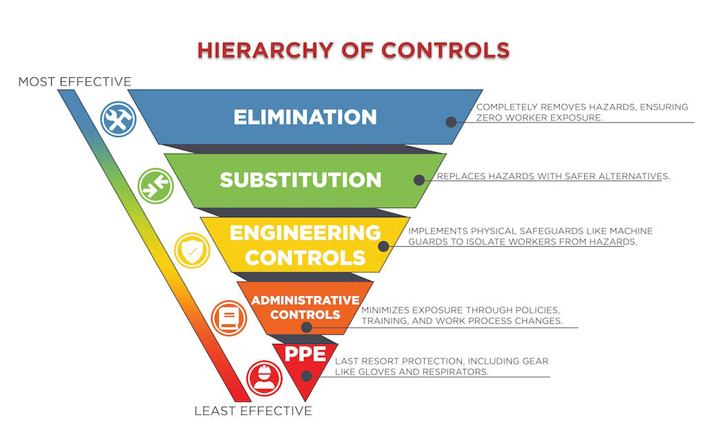
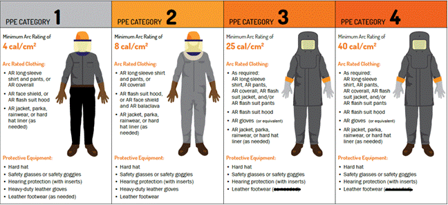
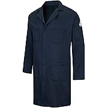
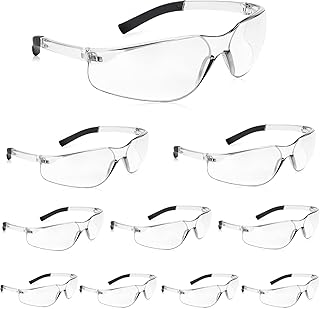
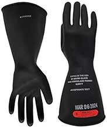
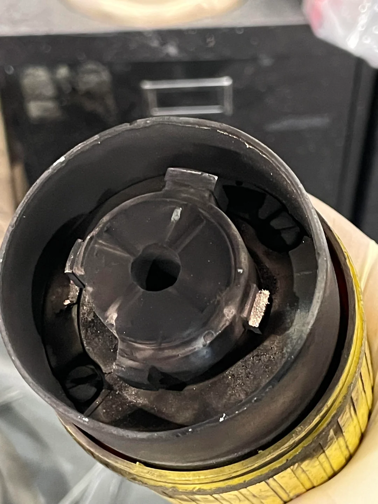
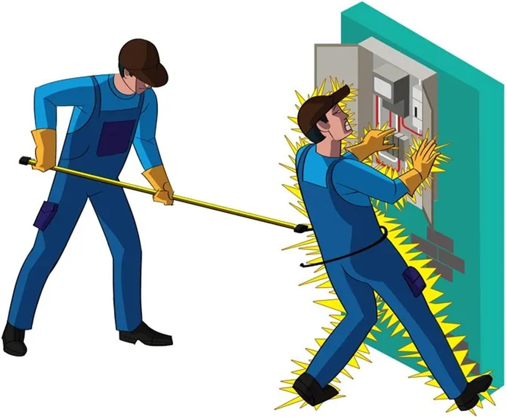
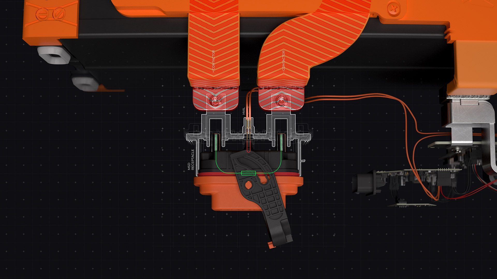

# Safety Best Practices

## Primary: Design the Hazard Away

This is the primary solution for electrical safety.

**Hierarchy of Controls:**

1. **Eliminate:** Delete or replace the hazard altogether
2. **Reduce:** If the hazard must exist, add features to minimize risk:
   - Guards to prevent access to hazards
   - Over current protections to reduce severity
   - Process steps to verify hazards are not present during system assembly

## Wear Appropriate PPE

Working at Terraform Industries exposes you to PPE Category 1 level risks. The
following PPE is **required** when working around 208 VAC, 480 VAC,
photovoltaic VDC, and battery VDC systems:

**Required PPE:**

- Insulated rubber gloves with leather protective covers
- Arc-rated (AR) lab coat or jacket
- Safety glasses

**PPE Locations:**

- Lab Coats: Located near the Black PPE cabinet in DAC Bay
- Insulated Gloves: Located in Black PPE cabinet
- Safety Glasses: Available throughout facility

## PPE Classifications and Requirements

Understanding proper PPE selection is critical for electrical safety. Different
voltage levels and arc flash incident energies require specific protective
equipment rated for those hazards.

### Insulated Glove Classifications

Insulated rubber gloves are classified by voltage rating with color-coded
labels:

- **Class 0 Gloves**: Up to 1,000V (red label)
- **Class 1 Gloves**: Up to 7,500V (white label)
- **Class 2 Gloves**: Up to 17,000V (yellow label)
- **Class 3 Gloves**: Up to 26,500V (green label)
- **Class 4 Gloves**: Up to 36,000V (orange label)

**Important:** Insulated gloves must always be worn with leather protective
covers to prevent punctures and abrasion damage.

### Arc-Rated Clothing Categories

Arc-rated (AR) clothing is classified by incident energy protection levels
measured in calories per square centimeter (cal/cm²):

- **Category 1**: Minimum 4 cal/cm² protection
  - Required for systems with incident energy up to 4 cal/cm²
  - Typical for 208V/480V distribution equipment
- **Category 2**: Minimum 8 cal/cm² protection
  - Required for systems with incident energy from 4.1 to 8 cal/cm²
  - Common for medium voltage switchgear
- **Category 3**: Minimum 25 cal/cm² protection
  - Required for systems with incident energy from 8.1 to 25 cal/cm²
  - Typically high voltage equipment and large motors
- **Category 4**: Minimum 40 cal/cm² protection
  - Required for systems with incident energy from 25.1 to 40 cal/cm²
  - High energy systems and major electrical distribution

**Note:** Arc flash incident energy calculations must be performed by qualified
personnel to determine the appropriate category.

### PPE Testing and Inspection Requirements

Regular testing and inspection of PPE is mandatory to ensure protection:

#### Insulated Gloves

- **Visual inspection**: Before each use, check for cuts, punctures, or
  deterioration
- **Air test**: Inflate gloves to check for leaks before each use
- **Electrical testing**: Required every 6 months by qualified testing facility
- **Storage**: Store in protective containers away from ozone, heat, and
  sunlight

#### Face Shields and Helmets

- **Daily inspection**: Check for cracks, scratches, or damage before use
- **Arc rating verification**: Ensure face shield meets required cal/cm² rating
- **Replacement criteria**: Replace immediately if damage is found

#### Arc-Rated Clothing

- **Label verification**: Check arc rating labels before each use
- **Damage inspection**: Look for tears, burns, or worn areas
- **Washing requirements**: Follow manufacturer's washing instructions to
  maintain arc rating
- **Replacement schedule**: Replace when damage is found or manufacturer's
  recommended service life is exceeded

#### Hot Sticks and Insulated Tools

- **Annual testing**: Required electrical testing by qualified facility
- **Visual inspection**: Check for cracks or damage before each use
- **Proper storage**: Store in clean, dry environment

### Additional Required PPE

Beyond the basic requirements, comprehensive electrical safety requires:

#### Safety Glasses

- **Standard**: ANSI Z87.1 rated for impact protection
- **Side shields**: Required for full protection
- **Prescription**: Safety prescription glasses available if needed

#### Face Shields

- **Arc flash protection**: Must be arc-rated for anticipated incident energy
- **Full face coverage**: Protect entire face and neck area
- **Used with safety glasses**: Face shields supplement, do not replace safety
  glasses

#### Hard Hats

- **Electrical rating**: Class E (electrical) rated for protection up to 20,000V
- **Inspection**: Check for cracks or damage before each use
- **Replacement**: Replace every 2-5 years depending on use and manufacturer
  recommendations

#### Safety Shoes

- **Electrical hazard (EH) rated**: Provides secondary protection against
  electrical shock
- **ASTM standards**: Meet ASTM F2413 electrical hazard requirements
- **Sole integrity**: Ensure soles are not punctured or excessively worn

#### Hearing Protection

- **High-noise electrical areas**: Required in areas above 85 dBA
- **Arc flash events**: Protect against acoustic energy from electrical arcs
- **Types**: Earplugs or earmuffs rated for noise level

### PPE Selection Guide

Proper PPE selection requires careful consideration of multiple factors:

#### Voltage Level Considerations

- **Under 50V**: Basic safety glasses and appropriate footwear
- **50V to 1000V**: Class 0 insulated gloves, Category 1 AR clothing minimum
- **Over 1000V**: Higher class gloves and AR clothing based on arc flash study

#### Arc Flash Incident Energy

- **Perform calculation**: Qualified electrical engineer must determine incident
  energy
- **Select appropriate category**: Choose AR clothing that meets or exceeds
  calculated energy level
- **Consider boundaries**: Establish arc flash protection boundaries

#### Environmental Conditions

- **Wet conditions**: Use waterproof or water-resistant PPE
- **Chemical exposure**: Ensure compatibility with chemicals present
- **Temperature extremes**: Select PPE rated for environmental conditions

#### Critical Safety Rules

**⚠ NEVER use damaged or expired PPE:**

- Compromised PPE provides no protection
- When in doubt, replace the equipment
- Document PPE inspections and testing

**⚠ NEVER modify PPE:**

- Alterations void safety ratings
- Use only manufacturer-approved accessories
- Follow all manufacturer instructions

**⚠ NEVER share insulated gloves:**

- Each worker needs properly fitted gloves
- Sharing increases contamination risk
- Personal fit is critical for dexterity and safety

## Trust But Verify

When working on high voltage systems, always measure the system voltage before
removing your PPE.

**Key Points:**

- Even if unplugged, capacitors can store enough energy to seriously harm you
- Use your PPE and a DVOM (digital voltage ohm meter) rated for the system
  voltage
- Verify the voltage is at or below 60V before considering the system safe
- Always follow proper DVOM usage procedures

## Never Connect or Disconnect Under Load

Connecting or disconnecting connectors under load significantly increases the
risk of arcing. Many components are not designed to safely extinguish arcs or
withstand the intense heat they generate.

**Proper Procedure:**

1. Always disconnect the load first using:
   - Circuit breaker
   - Service disconnect
   - Contactor
   - Solid-state relay
2. Then safely unplug the connector
3. For 480V and 208V tools:
   - Turn off the breaker before plugging in the component
   - Secure the connection
   - Turn the breaker back on

**⚠ Warning:** The example connector shown vaporized due to an arc while being
plugged in under load.

**Reference:** [Reddit example of 480V receptacle explosion](https://www.reddit.com/r/Welding/comments/11xv2cr/our_480v_receptacle_exploded_while_i_was_plugging/#lightbox)

**⚠ WARNING:**  
The legs of this Male NEMA plug have VAPORIZED due to arc flash!  
The Redditor is lucky to live to tell about it.

## Use the Buddy System

Use a buddy when working on hazardous voltages.

**Buddy Requirements:**

- Should be nearby to separate you from the energy source in case of shock
- Should NOT be working on the same high voltage system
- Can use a shepherd's hook or front "Spartan" kick for separation
- Should never attempt to separate you by hand due to their own risk of
  electrical contact

<!-- markdownlint-disable -->
<figure style="text-align: center;">
  
  <figcaption><em>The "Spartan Kick" emergency separation technique - When someone is being electrocuted by 480VAC, their muscles will lock up and they cannot let go of the conductor. A forceful kick to separate them from the electrical source may save their life. NEVER attempt to pull them away with your hands as the current can conduct through their body into yours, causing both of you to become victims. The kick must be swift and decisive, using your foot (insulated by rubber sole) to break contact between the victim and the electrical source. This aggressive action, while potentially causing minor injury from the impact, prevents death from electrocution or severe burns from prolonged electrical contact.</em></figcaption>
</figure>
<!-- markdownlint-enable -->

## Know Your Service Disconnects

High voltage systems should incorporate breakpoints to divide hazardous voltage
into smaller, safer segments.

**Examples:**

- A 1000V PV array split at 9 points has a maximum voltage of 100V per section
- A 1000V PV array split at 4 points has a maximum voltage of 200V per section

**Implementation:** This can be accomplished with:

- Dedicated manual service disconnects
- Existing system components by modifying assembly order

